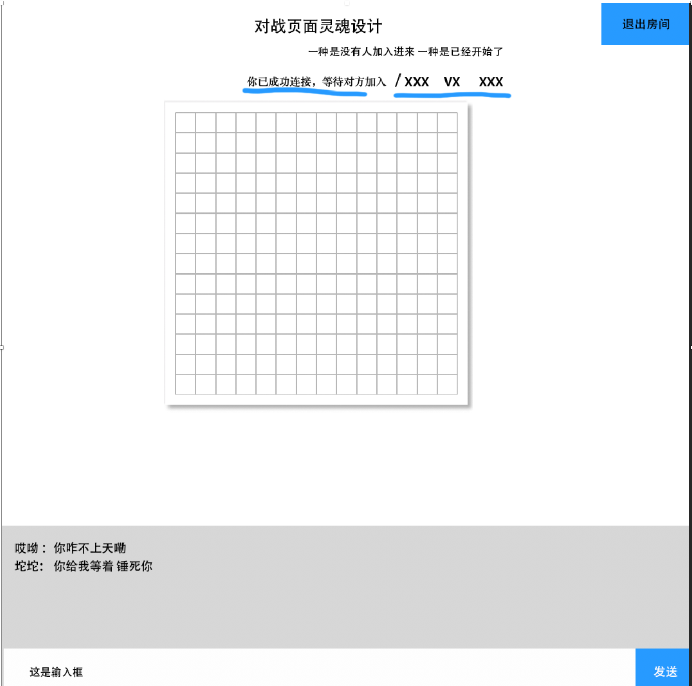

 ## 在线双人五子棋大战 

实现功能
	对战双方可以互动      给对方发送 消息
拥有大厅功能  可以自己创建房间 
可以加入别人的房间
房间可以退出   当房间所在人数为0时 房间自动销毁

后台使用: 

gin  websocket  实现  数据库 用 redis 数据不做持久化处理
这个下棋本身就是 瞎玩 所以不保留用户的 下棋记录和 账号 记录

房间记录
 redis 存储 
 游戏状态当前到哪里一步
 标题
 对战双方
 人员是否就位状态
 某一方中途退出比赛房间 可以操控重置比赛 (开始比赛  继续比赛) (这两个 是在另一方有人加入的情况下即可操作)

游戏逻辑
 15*15 矩阵  每一个子的位置 =  (x(或者)y) *   (当前第几格*(100/15))
 225 个位置
 每下一个位置  数据由后台验证 下一步 返回格式化 过后的 数据 渲染  以及计算  是否 输赢
 1*1
 
 
 
 

 赞助商 
 票销售 nba 世界杯
 报名参加活动培训班
 
 

####gin 
`
go get -u github.com/gin-gonic/gin
`

#### redis
`
go get github.com/gomodule/redigo/redis
`

####websocket
`
go get github.com/gorilla/websocket
`
####go.uuid
`
go get -u github.com/satori/go.uuid
`

前台：  姜宝宝 自己想
姜宝宝 负责一个界面就ok了  就是 对战那个 页面 

